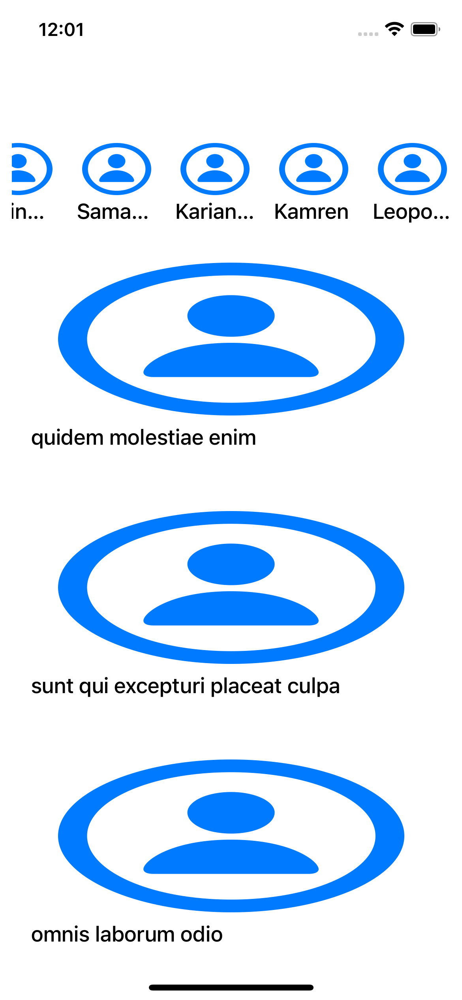
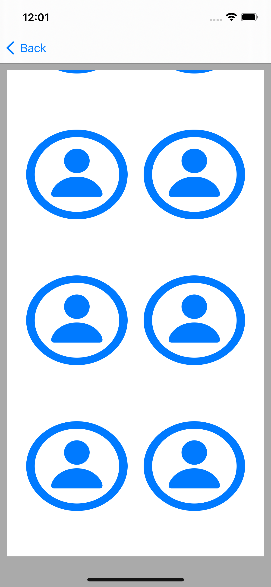

# Albums Feed
Build a simple album app

### Fetch API from User and Album
- user api:https://jsonplaceholder.typicode.com/users
- album api:https://jsonplaceholder.typicode.com/albums

### Show data
- show Users and Albums section
- click Album show Album Scene

### Fetch API from photo
- api:https://jsonplaceholder.typicode.com/photos

### Show data
- vertical scrollable list, to show all photos in the album

### ScreenShot

**Main Scene**

**Album Scene**

